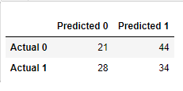
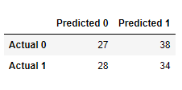
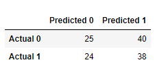
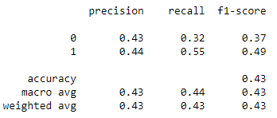
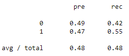
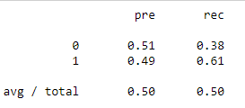
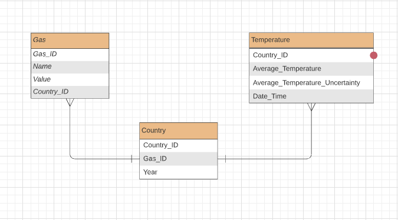
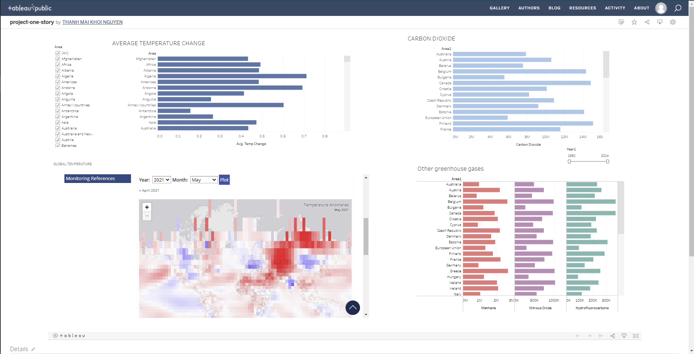

# project-one
A shared repository for first projects.

## Overview

- The project aims to analyze the relationship and the trends between the international greenhouse gas emissions and records of Earth surface temperature in order to determine if there is any correlation supporting or refuting the claim that greenhouse gas emissions are warming the planet. We chose this direction because there are still people on both sides of the argument unwilling to listen to the other, and this analysis would help determine the correlation between greenhouse emissions and Earth surface temperature. In particular, the questions we need answered are:
  - Is there any correlation between the two to begin with?
  - If there is, is it positive or negative?
  - If there isn't, why isn't there a positive or negative correlation?

## Analysis:

- GitHub:
  - Throughout this project, the group has been communicating via a group chat in Slack, as well as over Zoom when text discussion otherwise proved to not be enough.

- Machine Learning Model:
  - In order to be able to work with the Machine Learning Model, we first need to ensure there's a clean, workable data set to work with. The two data sets we found did not work out well in that aspect -- The one we needed in a simple one-value format was in two dimensions, so to speak, and the one that would have worked better as a matrix of values was in a single-value format. In order to remedy this, df_Unpack.ipynb was formed. It consists of a number of functions to better help with getting the data into better, more workable forms, including ones to duplicate the entries for areas and years of the two-dimensional array in a way that would let each area-year pair be unique, as well as ones to move the data from a two-dimensional format to a one-dimensional one, and vice-versa.
  - As an example of how the data changed, here is how the temperatures looked when we pruned the entries without full information:

    

  - And here's how they looked after reformatting them into a single-entry DataFrame:

    

  - Greenhouse Gases table before reformatting:

    

  - Greenhouse Gases table after reformatting:

    

  - Originally for the Machine Learning Model itself, we considered an unsupervised learning model, but found that, the more we looked at how the data worked, the less reason there came to be for one to be used. So, instead, we decided on working with a confusion matrix. The greenhouse gases data had plenty of potential inputs for a large handful of countries between 1990 and 2014, and the temperature data had plenty of data between months, quarters, and years on how surface temperature changed between 1961 and 2019. On a year scale, this would work well enough for our preliminary confusion matrix, so we merged the data sets so that we would have a series of rows with the different greenhouse gas amounts for a given year and country, followed by the change in surface temperature for that same year and country. Since confusion matrices have discrete y vectors, however, we had to come up with a rule for the matrix to be made. For the time being, it was simple: If the yearly change in temperature was greater than 1 degree celsius, it would be labeled as a notable change in temperature with a 1. Otherwise, it wouldn't be notable, and it would be a 0. From there we could determine if there was any kind of correlation between an increase of a specific greenhouse gas and a notable increase in surface temperature.
  - Initially, the testing and training sets for this are mostly randomly picked from the merged data set, with no specific ratio between them. However, these didn't demonstrate much of a conclusive story -- all it showed was that randomly picking from the dataset and predicting from that was going to demonstrate that the model was horrible at determining if significant temperature changes were going to occur with given greenhouse gas emissions. So we decided to run some additional tests with Balanced Random Forest and Easy Ensemble to determine if there would any significant change in the numbers we were finding.
  - We chose to model a logistic regression with the data. Temperature changes are a common part of the weather cycle of the earth, but if they're significant enough for a particular year, there may be some underlying reason behind a particularly high change. We think it's likely that the levels of greenhouse gas emissions for a given year could provide an explanation on statistically significant shifts in temperature (changes greater than 1 degree Centigrade).

  - Here is the Confusion Matrix for the general test, the Balanced Random Forest classification, and the Easy Ensemble classification, respectively:

       
    
  - Here are the precision and recall values corresponding to each confusion matrix shown above:

    
    
     
    
    
- Database:
  - Using multiple csv files from different sources, we hope to answer the question by trying to find a correlation between them. The first dataset shows the information of International Greenhouse Gas Emissions between 1990 and 2017, while the second one presents the Earth Surface Temperature from as early as 1743, spanning up to August of 2013.

  - Get started by using Python's jupyter notebook to present the dataset. The ERD is also added to clarify the relation among entities. Might use unsupervised learning models. Statistics would be shown such as charts.
 
  - ERD: 
   
     
 
  - Dashboard
    
    - Google Slide: https://docs.google.com/presentation/d/1-Ytf0_jgAMNVzL9pkt7GMMhAFl3zb_KHhs7zXQtXqhs/edit#slide=id.p
    - Description of tools used to create final dashboard
       - Postgres SQL: create and manage database used for final visualization
       - Python-Jupyter Notebook: data cleaning, create new and cleaned datasets to visualize
       - GitBash: Command-line interface
       - Github: Deploy final Data visualization
       - Tableau : for visualization and interaction
    - Interactive element:
       - All of graphs, charts and maps within the dashboard could be interacted.
    - About the dashboard: 
       - Tableau Dashboard : https://public.tableau.com/app/profile/thanh.mai.khoi.nguyen/viz/project-one-story/Dashboard1
    
      
            

