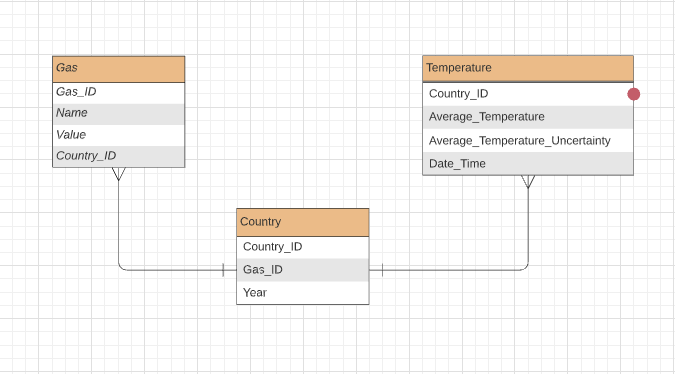
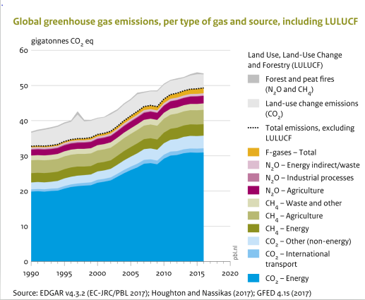
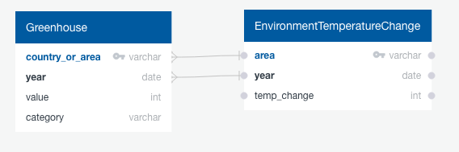

# project-one
A shared repository for first projects.

## Overview

- The project aims to analyze the relationship and the trends between the international greenhouse gas emissions and records of Earth surface temperature in order to determine if there is any correlation supporting or refuting the claim that greenhouse gas emissions are warming the planet. We chose this direction because there are still people on both sides of the argument unwilling to listen to the other, and this analysis would help determine the correlation between greenhouse emissions and Earth surface temperature. In particular, the questions we need answered are:
  - Is there any correlation between the two to begin with?
  - If there is, is it positive or negative?
  - If there isn't, why isn't there a positive or negative correlation?

## Analysis:

- GitHub:
  - Throughout this project, the group has been communicating via a group chat in Slack.

- Machine Learning Model:
  - The dataset is shown in jupyter notebook.
  
- Database:
  - Using multiple csv files from different sources, we hope to answer the question by trying to find a correlation between them. The first dataset shows the information of International Greenhouse Gas Emissions between 1990 and 2017, while the second one presents the Earth Surface Temperature from as early as 1743, spanning up to August of 2013.

  - Get started by using Python's jupyter notebook to present the dataset. The ERD is also added to clarify the relation among entities. Might use unsupervised learning models. Statistics would be shown such as charts.
 
  - ERD: 
   
     
 
  - Chart: 
  
     
     
  - ERD used for SQL tables

     

